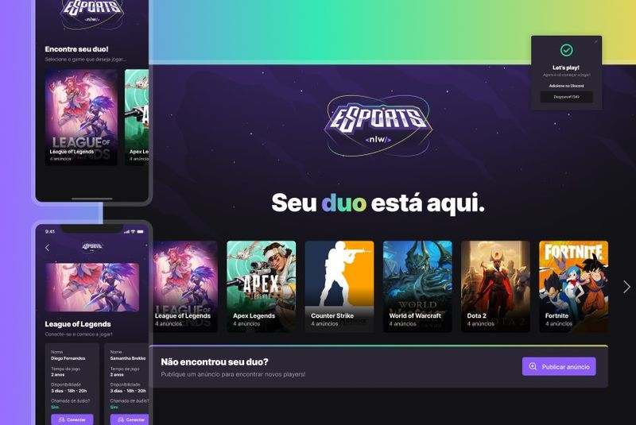

<h1 align="center">
    
</h1>

<p align="center">
  

  
  
  <a href="https://github.com/sbezerrarafa/esports/commits/main">
    
  </a>

  <a href="https://github.com/sbezerrarafa/esports/issues">
    
  </a>

  
</p>

<p align="center">
  <a href="#rocket-tecnologias">Tecnologias</a>&nbsp;&nbsp;&nbsp;|&nbsp;&nbsp;&nbsp;
  <a href="#-projeto">Projeto</a>&nbsp;&nbsp;&nbsp;|&nbsp;&nbsp;&nbsp;
  <a href="#-layout">Layout</a>&nbsp;&nbsp;&nbsp;|&nbsp;&nbsp;&nbsp;
  <a href="#-como-contribuir">Como contribuir</a>&nbsp;&nbsp;&nbsp;|&nbsp;&nbsp;&nbsp;
  <a href="#memo-licença">Licença</a>
</p>

<br>

<p align="center">
  
</p>

## :rocket: Tecnologias

Esse projeto foi desenvolvido com as seguintes tecnologias:

- [Node.js](https://nodejs.org/en/)
- [React](https://reactjs.org)
- [React Native](https://facebook.github.io/react-native/)

## 💻 Projeto

Este Projeto teve como base, as stacks citadas, garantindo uma aplicação completa com front-end e back-end, o projeto original criado no nlw, desenvolvido pela rocketseat, tem algumas diferenças na parte do mobile, pois o mesmo foi desenvolvido em expo, já o projeto apresentado aqui foi feito inteiramente em react native init, com isso foi necessário fazer diversar modificações no projeto mobile, já o projeto web sofreu poucas modificações, e apenas algumas melhorias, espero que aproveitem o código e divirtam-se.

## 🔖 Layout

Você pode baixar o layout do projeto no formato `.sketch` através [desse link](https://www.figma.com/community/file/1150897317533332617).

Para abrir o arquivo no formato `.sketch` em qualquer sistema operacional utilize a ferramenta [Figma](https://figma.com).

## 🤔 Como contribuir

- Faça um fork desse repositório;
- Cria uma branch com a sua feature: `git checkout -b minha-feature`;
- Faça commit das suas alterações: `git commit -m 'feat: Minha nova feature'`;
- Faça push para a sua branch: `git push origin minha-feature`.

Depois que o merge da sua pull request for feito, você pode deletar a sua branch.

## :memo: Licença

Esse projeto está sob a licença **MIT**. Veja o arquivo [LICENSE](LICENSE) para mais detalhes.

---

## Quickstart

### Server

Primeiro, crie um arquivo `.env` no seu diretorio raiz, use o `.env.example` como template de base.

Depois, db run:

```sh
$ npm install
$ npm run db:migrate
```

Finalmente, para mandar o start no seu server, rode:

```sh
$ npm run dev
```

### Web

Para rodar web:

```sh
$ npm install
$ npm run dev

or
$ yarn
$ yarn dev

```

### Mobile

Para rodar web:

```sh
$ npm install
$npx react-native run-android

or
$ yarn
$npx react-native run-android

```
